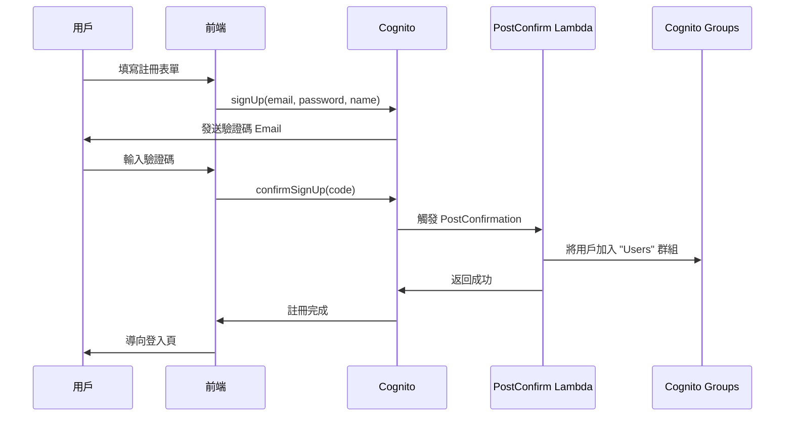
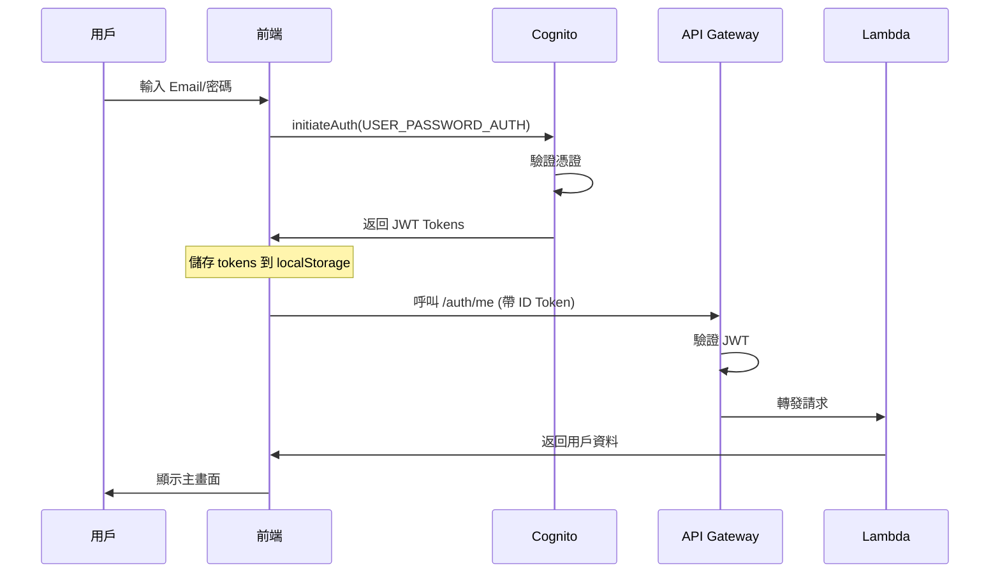
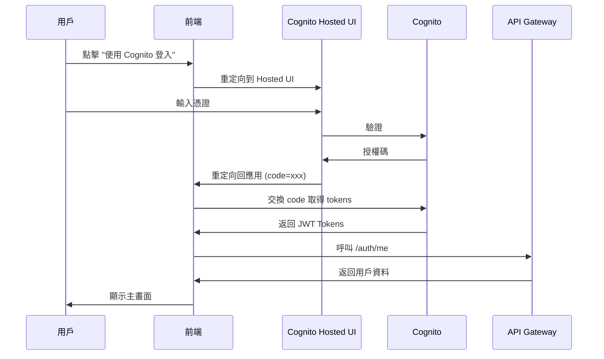
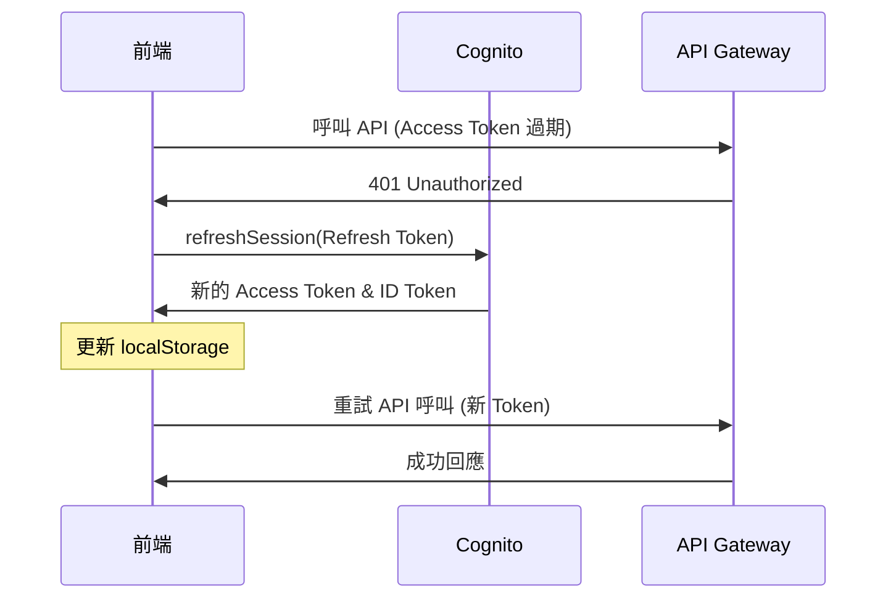
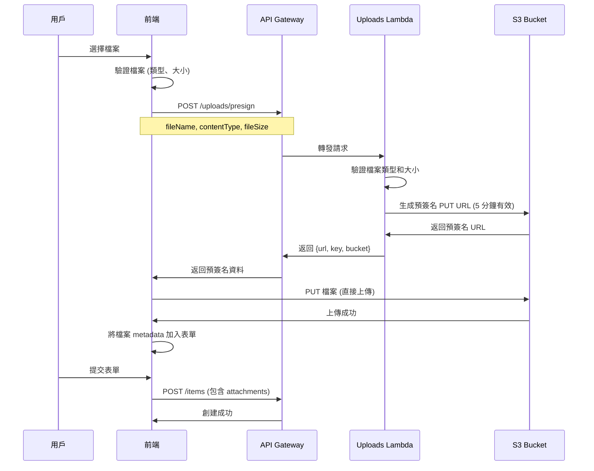

# SparkBoard 系統架構文件

> **最後更新：** 2025-11-18  
> **版本：** 1.0.0

## 📋 目錄

- [系統架構總覽](#系統架構總覽)
- [資料庫設計](#資料庫設計)
- [API 設計](#api-設計)
- [身份驗證流程](#身份驗證流程)
- [檔案上傳流程](#檔案上傳流程)
- [權限系統](#權限系統)

---

## 🏗️ 系統架構總覽

### 高階架構圖

```
┌─────────────────────────────────────────────────────────────────┐
│                          用戶端                                   │
│  ┌──────────────────────────────────────────────────────────┐  │
│  │  React 19 + TypeScript + Vite + TailwindCSS              │  │
│  │  - SPA (Single Page Application)                         │  │
│  │  - 客戶端路由 (React Router)                              │  │
│  │  - 狀態管理 (TanStack Query)                              │  │
│  └──────────────────────────────────────────────────────────┘  │
└─────────────────────────────────────────────────────────────────┘
                              ↓ HTTPS
┌─────────────────────────────────────────────────────────────────┐
│                      CloudFront CDN                              │
│  - SSL/TLS 終止                                                  │
│  - 靜態資產快取 (1 年 TTL)                                       │
│  - Gzip 壓縮                                                     │
│  - 全球邊緣節點                                                  │
└─────────────────────────────────────────────────────────────────┘
                              ↓
┌─────────────────────────────────────────────────────────────────┐
│                      S3 靜態網站託管                              │
│  - index.html (SPA 入口)                                        │
│  - /assets/* (JS, CSS, 圖片)                                    │
│  - 私有存取 (透過 OAI)                                          │
└─────────────────────────────────────────────────────────────────┘

                              ↓ API 呼叫 (HTTPS)

┌─────────────────────────────────────────────────────────────────┐
│                    API Gateway (REST API)                        │
│  - CORS 配置                                                     │
│  - Request/Response 轉換                                         │
│  - 限流 (10000 req/s)                                           │
│  - CloudWatch 日誌                                               │
│  - X-Ray 追蹤                                                    │
└─────────────────────────────────────────────────────────────────┘
                              ↓
              ┌───────────────┴───────────────┐
              ↓                               ↓
┌──────────────────────────┐    ┌──────────────────────────┐
│  Cognito Authorizer      │    │  Lambda Functions        │
│  - JWT 驗證              │    │  - Items                 │
│  - 用戶資訊注入          │    │  - Auth                  │
└──────────────────────────┘    │  - Uploads               │
                                │  - Users                 │
                                │  - Monitoring            │
                                │  - Health                │
                                └──────────────────────────┘
                                          ↓
                ┌─────────────────────────┼─────────────────────────┐
                ↓                         ↓                         ↓
  ┌──────────────────────┐  ┌──────────────────────┐  ┌──────────────────────┐
  │  DynamoDB            │  │  S3                  │  │  Cognito User Pool   │
  │  - SparkTable        │  │  - Files Storage     │  │  - 用戶管理          │
  │  - GSI1 (用戶索引)   │  │  - Presigned URLs    │  │  - 群組管理          │
  │  - GSI2 (全域索引)   │  └──────────────────────┘  │  - OAuth             │
  └──────────────────────┘                            └──────────────────────┘

                              ↓

┌─────────────────────────────────────────────────────────────────┐
│                       EventBridge                                │
│  - Scheduled Rule (每分鐘)                                       │
│  - 觸發 AutoArchive Lambda                                       │
└─────────────────────────────────────────────────────────────────┘
                              ↓
                  ┌──────────────────────┐
                  │  AutoArchive Lambda  │
                  │  - 自動封存任務      │
                  └──────────────────────┘

                              ↓

┌─────────────────────────────────────────────────────────────────┐
│                    CloudWatch + X-Ray                            │
│  - 日誌聚合                                                      │
│  - 指標收集                                                      │
│  - 告警                                                          │
│  - 分散式追蹤                                                    │
└─────────────────────────────────────────────────────────────────┘
```

### 技術棧總結

| 層級 | 技術 | 服務 |
|------|------|------|
| **前端** | React 19, TypeScript, Vite | CloudFront + S3 |
| **API 層** | REST API | API Gateway |
| **運算層** | Node.js 18.x | Lambda Functions (8 個) |
| **資料層** | NoSQL | DynamoDB (單表設計) |
| **檔案儲存** | 物件儲存 | S3 |
| **身份驗證** | OAuth 2.0, JWT | Cognito User Pools |
| **監控** | 日誌、指標、追蹤 | CloudWatch, X-Ray |
| **事件** | 排程觸發 | EventBridge |
| **通知** | Email | SNS |

---

## 🗄️ 資料庫設計

### Single Table Design (單表設計)

SparkBoard 使用 DynamoDB 單表設計模式，所有實體類型存儲在同一個表中。

#### 表結構

```yaml
Table Name: SparkTable
Partition Key: PK (String)
Sort Key: SK (String)
Billing Mode: On-Demand (PAY_PER_REQUEST)
```

#### 實體類型與鍵設計

##### 1. 任務/公告 (ITEM)

```javascript
{
  // 主鍵
  PK: "ORG#sparkboard-demo",
  SK: "ITEM#a1b2c3d4-e5f6-7890-abcd-ef1234567890",
  
  // GSI 鍵
  GSI1PK: "USER#c7e46ab8-f0b1-70f0-78c6-0d6c51ceeb63",
  GSI1SK: "ITEM#2025-11-18T10:30:00.000Z",
  GSI2PK: "ITEM#ALL",
  GSI2SK: "2025-11-18T10:30:00.000Z",
  
  // 元資料
  entityType: "ITEM",
  itemId: "a1b2c3d4-e5f6-7890-abcd-ef1234567890",
  orgId: "sparkboard-demo",
  
  // 用戶資訊
  userId: "c7e46ab8-f0b1-70f0-78c6-0d6c51ceeb63",
  username: "張三",
  email: "zhangsan@example.com",
  
  // 內容
  title: "完成專案文件",
  content: "需要撰寫技術文件和使用者手冊",
  type: "task", // 或 "announcement"
  
  // 狀態
  status: "active", // "active" | "completed" | "archived"
  priority: "high", // "low" | "medium" | "high" | "urgent"
  
  // 附件
  attachments: [
    {
      name: "design.pdf",
      url: "https://s3.amazonaws.com/...",
      type: "application/pdf",
      size: 1024000,
      key: "userId/2025-11-18/uuid-design.pdf"
    }
  ],
  
  // 任務特定欄位
  subtasks: [
    {
      id: "sub-1",
      title: "撰寫架構文件",
      completed: true,
      completedAt: "2025-11-18T12:00:00.000Z"
    }
  ],
  deadline: "2025-11-25T23:59:59.000Z",
  hasBeenInProgress: true,
  
  // 公告特定欄位
  expiresAt: "2025-12-01T00:00:00.000Z",
  isPinned: true,
  pinnedUntil: "2025-11-20T00:00:00.000Z",
  
  // 封存相關
  autoArchiveAt: "2025-11-26T00:00:00.000Z",
  archivedAt: "2025-11-26T00:05:00.000Z",
  archiveStatus: "completed", // "completed" | "partial" | "aborted"
  
  // 管理員註解
  annotations: [
    {
      id: "ANN#1731931200000",
      itemSk: "ITEM#a1b2c3d4-e5f6-7890-abcd-ef1234567890",
      adminId: "admin-user-id",
      adminName: "管理員",
      content: "此任務需要優先處理",
      createdAt: "2025-11-18T15:00:00.000Z"
    }
  ],
  
  // 時間戳記
  createdAt: "2025-11-18T10:30:00.000Z",
  updatedAt: "2025-11-18T14:20:00.000Z",
  completedAt: "2025-11-25T16:45:00.000Z"
}
```

##### 2. 用戶資料 (USER_PROFILE)

```javascript
{
  PK: "USER#c7e46ab8-f0b1-70f0-78c6-0d6c51ceeb63",
  SK: "PROFILE",
  
  entityType: "USER_PROFILE",
  userId: "c7e46ab8-f0b1-70f0-78c6-0d6c51ceeb63",
  
  // Cognito 同步欄位
  email: "user@example.com",
  username: "張三",
  
  // 擴展資料
  bio: "前端工程師，專注於 React 開發",
  avatarUrl: "https://s3.amazonaws.com/.../avatar.jpg",
  theme: "dark", // 'light' | 'dark' | 'system'
  
  createdAt: "2025-01-01T00:00:00.000Z",
  updatedAt: "2025-11-18T10:00:00.000Z"
}
```

### Global Secondary Indexes (GSI)

#### GSI1 - 用戶項目索引

**用途：** 查詢特定用戶創建的所有項目

```yaml
Index Name: GSI1
Partition Key: GSI1PK (USER#userId)
Sort Key: GSI1SK (ITEM#timestamp)
Projection: ALL
```

**查詢範例：**
```javascript
// 查詢用戶的所有任務，按時間排序
const params = {
  TableName: 'SparkTable',
  IndexName: 'GSI1',
  KeyConditionExpression: 'GSI1PK = :gsi1pk',
  ExpressionAttributeValues: {
    ':gsi1pk': 'USER#c7e46ab8-f0b1-70f0-78c6-0d6c51ceeb63'
  },
  ScanIndexForward: false // 最新的在前
}
```

#### GSI2 - 全域項目索引

**用途：** 查詢所有項目，支援分頁和時間排序

```yaml
Index Name: GSI2
Partition Key: GSI2PK (ITEM#ALL)
Sort Key: GSI2SK (timestamp ISO string)
Projection: ALL
```

**查詢範例：**
```javascript
// 取得最新的 20 個項目
const params = {
  TableName: 'SparkTable',
  IndexName: 'GSI2',
  KeyConditionExpression: 'GSI2PK = :gsi2pk',
  ExpressionAttributeValues: {
    ':gsi2pk': 'ITEM#ALL'
  },
  ScanIndexForward: false, // 最新的在前
  Limit: 20,
  ExclusiveStartKey: lastEvaluatedKey // 分頁
}
```

### 查詢模式

| 查詢需求 | 使用的索引 | 複雜度 |
|---------|-----------|--------|
| 取得特定項目 | 主表 (PK + SK) | O(1) |
| 列出組織的所有項目 | 主表 (PK) | O(n) |
| 列出用戶的所有項目 | GSI1 | O(n) |
| 列出全域最新項目 | GSI2 | O(n) |
| 搜尋特定時間範圍的項目 | GSI2 + 範圍查詢 | O(n) |

### 資料存取模式

#### 寫入 (Write)

```javascript
// 創建項目時同時寫入所有索引鍵
const item = {
  PK: `ORG#${orgId}`,
  SK: `ITEM#${itemId}`,
  GSI1PK: `USER#${userId}`,
  GSI1SK: `ITEM#${timestamp}`,
  GSI2PK: 'ITEM#ALL',
  GSI2SK: timestamp,
  // ... 其他欄位
}

await docClient.send(new PutCommand({
  TableName: 'SparkTable',
  Item: item
}))
```

#### 更新 (Update)

```javascript
// 只更新需要修改的欄位
await docClient.send(new UpdateCommand({
  TableName: 'SparkTable',
  Key: {
    PK: `ORG#${orgId}`,
    SK: `ITEM#${itemId}`
  },
  UpdateExpression: 'SET #status = :status, updatedAt = :updatedAt',
  ExpressionAttributeNames: {
    '#status': 'status'
  },
  ExpressionAttributeValues: {
    ':status': 'completed',
    ':updatedAt': new Date().toISOString()
  }
}))
```

#### 刪除 (Delete)

```javascript
// DynamoDB 會自動處理 GSI 索引的刪除
await docClient.send(new DeleteCommand({
  TableName: 'SparkTable',
  Key: {
    PK: `ORG#${orgId}`,
    SK: `ITEM#${itemId}`
  }
}))
```

### 容量規劃

#### On-Demand 定價優勢

- ✅ 自動擴展，無需預配置容量
- ✅ 按實際讀寫請求計費
- ✅ 非常適合不可預測的工作負載
- ✅ 峰值流量自動處理

#### 預估成本 (以台灣地區為例)

```
讀取單位成本: $0.25 / 百萬次
寫入單位成本: $1.25 / 百萬次
儲存成本: $0.25 / GB-月

假設每月:
- 100 萬次讀取 = $0.25
- 20 萬次寫入 = $0.25
- 1 GB 儲存 = $0.25
總計: ~$0.75 / 月
```

---

## 🔌 API 設計

### RESTful API 端點

#### 基礎 URL

```
Production: https://{api-id}.execute-api.{region}.amazonaws.com/prod
Development: http://localhost:3000
```

#### 認證

所有端點（除了 `/health`）都需要在 Header 中提供 JWT Token：

```http
Authorization: eyJraWQiOiJ0T1hmRHVl...
```

### 端點清單

#### 1. Health Check

```http
GET /health
```

**回應：**
```json
{
  "status": "healthy",
  "timestamp": "2025-11-18T10:00:00.000Z",
  "version": "1.0.0",
  "resources": {
    "table": "SparkTable",
    "bucket": "sparkboard-files-434824683139-ap-northeast-1"
  }
}
```

#### 2. 身份驗證

```http
GET /auth/me
PATCH /auth/me
```

**GET /auth/me 回應：**
```json
{
  "userId": "c7e46ab8-f0b1-70f0-78c6-0d6c51ceeb63",
  "email": "user@example.com",
  "username": "張三",
  "groups": ["Users"],
  "orgId": "sparkboard-demo",
  "bio": "前端工程師",
  "avatarUrl": "https://s3.amazonaws.com/.../avatar.jpg"
}
```

**PATCH /auth/me 請求：**
```json
{
  "name": "李四",
  "bio": "更新的個人簡介",
  "avatarUrl": "https://s3.amazonaws.com/.../new-avatar.jpg"
}
```

#### 3. 項目管理 (Items)

##### 創建項目

```http
POST /items
Content-Type: application/json
```

**請求體 (任務)：**
```json
{
  "type": "task",
  "title": "完成專案文件",
  "content": "撰寫技術架構和 API 文件",
  "priority": "high",
  "deadline": "2025-11-25T23:59:59.000Z",
  "attachments": [
    {
      "name": "requirements.pdf",
      "url": "https://s3.amazonaws.com/...",
      "type": "application/pdf",
      "size": 1024000,
      "key": "userId/2025-11-18/uuid-requirements.pdf"
    }
  ],
  "subtasks": [
    { "id": "sub-1", "title": "架構設計", "completed": false }
  ]
}
```

**請求體 (公告)：**
```json
{
  "type": "announcement",
  "title": "系統維護通知",
  "content": "系統將於本週五進行維護",
  "priority": "urgent",
  "expiresAt": "2025-11-22T00:00:00.000Z",
  "isPinned": true,
  "pinnedUntil": "2025-11-22T00:00:00.000Z"
}
```

**回應 (201 Created)：**
```json
{
  "success": true,
  "item": {
    "itemId": "a1b2c3d4-e5f6-7890-abcd-ef1234567890",
    "sk": "ITEM#a1b2c3d4-e5f6-7890-abcd-ef1234567890",
    // ... 完整項目資料
  }
}
```

##### 列出項目

```http
GET /items?limit=20&lastKey=encodedKey&type=task&status=active
```

**查詢參數：**
- `limit` - 每頁數量（預設 20，最大 100）
- `lastKey` - 分頁游標（從上一頁的 `lastEvaluatedKey` 取得）
- `type` - 過濾類型：`task` 或 `announcement`
- `status` - 過濾狀態：`active`, `completed`, `archived`

**回應：**
```json
{
  "items": [
    { /* 項目 1 */ },
    { /* 項目 2 */ }
  ],
  "count": 20,
  "lastEvaluatedKey": "base64EncodedKey"
}
```

##### 取得單一項目

```http
GET /items/{itemId}
```

**回應：**
```json
{
  "item": {
    "itemId": "a1b2c3d4-e5f6-7890-abcd-ef1234567890",
    "title": "完成專案文件",
    // ... 完整項目資料
  }
}
```

##### 更新項目

```http
PATCH /items/{itemId}
Content-Type: application/json
```

**請求體：**
```json
{
  "title": "更新的標題",
  "content": "更新的內容",
  "status": "completed",
  "subtasks": [
    { "id": "sub-1", "title": "架構設計", "completed": true }
  ]
}
```

##### 刪除項目

```http
DELETE /items/{itemId}?forceDelete=true
```

**查詢參數：**
- `forceDelete` - 管理員強制刪除（跳過限制檢查）

**限制：**
- 一般用戶只能刪除自己的項目
- 已進行中的任務不能被刪除（除非使用 `forceDelete`）
- 管理員可以刪除任何項目

#### 4. 檔案上傳

```http
POST /uploads/presign
Content-Type: application/json
```

**請求體：**
```json
{
  "fileName": "document.pdf",
  "contentType": "application/pdf",
  "fileSize": 1024000
}
```

**回應：**
```json
{
  "upload": {
    "url": "https://sparkboard-files.s3.amazonaws.com/...?X-Amz-Algorithm=...",
    "key": "userId/2025-11-18/uuid-document.pdf",
    "bucket": "sparkboard-files-434824683139-ap-northeast-1",
    "expiresIn": 300
  }
}
```

**使用流程：**
1. 前端呼叫 `/uploads/presign` 取得預簽名 URL
2. 前端使用 PUT 方法直接上傳檔案到 S3
3. 上傳成功後，將檔案的 `key` 和 `url` 儲存在項目的 attachments 中

#### 5. 用戶管理 (僅管理員)

##### 列出用戶

```http
GET /users
```

**回應：**
```json
{
  "users": [
    {
      "userId": "c7e46ab8-f0b1-70f0-78c6-0d6c51ceeb63",
      "username": "張三",
      "email": "zhangsan@example.com",
      "enabled": true,
      "status": "CONFIRMED",
      "groups": ["Users"],
      "createdAt": "2025-01-01T00:00:00.000Z"
    }
  ]
}
```

##### 管理群組成員

```http
POST /users/{userId}/groups
DELETE /users/{userId}/groups/{groupName}
```

**POST 請求體：**
```json
{
  "groupName": "Moderators"
}
```

##### 停用/啟用用戶

```http
POST /users/{userId}/disable
POST /users/{userId}/enable
```

##### 刪除用戶

```http
DELETE /users/{userId}
```

**限制：** 用戶必須先被停用才能刪除

#### 6. 監控 (僅管理員)

```http
GET /monitoring/metrics?period=300&hours=24
GET /monitoring/traces?limit=20
GET /monitoring/alarms
```

### 錯誤處理

所有 API 錯誤回應遵循統一格式：

```json
{
  "error": "ErrorType",
  "message": "人類可讀的錯誤訊息",
  "details": "額外的錯誤細節（可選）"
}
```

**常見錯誤代碼：**

| 狀態碼 | 錯誤類型 | 說明 |
|--------|---------|------|
| 400 | BadRequest | 請求參數錯誤或驗證失敗 |
| 401 | Unauthorized | 未提供或無效的授權 Token |
| 403 | Forbidden | 權限不足 |
| 404 | NotFound | 資源不存在 |
| 405 | MethodNotAllowed | 不支援的 HTTP 方法 |
| 409 | Conflict | 資源衝突 |
| 429 | TooManyRequests | 超過限流限制 |
| 500 | InternalServerError | 伺服器內部錯誤 |
| 503 | ServiceUnavailable | 服務暫時不可用 |

---

## 🔐 身份驗證流程

### 1. 用戶註冊流程



### 2. 用戶登入流程 (密碼登入)



### 3. OAuth 登入流程 (Hosted UI)



### 4. Token 刷新流程



### JWT Token 結構

#### ID Token (用於身份驗證)

```json
{
  "sub": "c7e46ab8-f0b1-70f0-78c6-0d6c51ceeb63",
  "cognito:groups": ["Admin"],
  "email_verified": true,
  "iss": "https://cognito-idp.ap-northeast-1.amazonaws.com/...",
  "cognito:username": "張三",
  "custom:orgId": "sparkboard-demo",
  "aud": "1vcpecf3tff27vb7f3svd12c6",
  "event_id": "...",
  "token_use": "id",
  "auth_time": 1731931200,
  "name": "張三",
  "exp": 1731934800,
  "iat": 1731931200,
  "email": "zhangsan@example.com"
}
```

#### Access Token (用於授權)

```json
{
  "sub": "c7e46ab8-f0b1-70f0-78c6-0d6c51ceeb63",
  "cognito:groups": ["Admin"],
  "iss": "https://cognito-idp.ap-northeast-1.amazonaws.com/...",
  "client_id": "1vcpecf3tff27vb7f3svd12c6",
  "origin_jti": "...",
  "event_id": "...",
  "token_use": "access",
  "scope": "openid profile email",
  "auth_time": 1731931200,
  "exp": 1731934800,
  "iat": 1731931200,
  "jti": "..."
}
```

### Token 有效期

| Token 類型 | 有效期 | 用途 |
|-----------|--------|------|
| ID Token | 60 分鐘 | 身份識別，包含用戶資訊 |
| Access Token | 60 分鐘 | API 授權 |
| Refresh Token | 30 天 | 刷新 Access/ID Token |

---

## 📤 檔案上傳流程

### S3 預簽名 URL 上傳

#### 完整流程



#### 前端實作範例

```typescript
async function uploadFilesToS3(files: File[]): Promise<FileAttachment[]> {
  const uploadedFiles: FileAttachment[] = []
  
  for (const file of files) {
    // 1. 取得預簽名 URL
    const presignRes = await fetch(`${API_URL}/uploads/presign`, {
      method: 'POST',
      headers: {
        'Content-Type': 'application/json',
        'Authorization': idToken
      },
      body: JSON.stringify({
        fileName: file.name,
        contentType: file.type,
        fileSize: file.size
      })
    })
    
    const { upload } = await presignRes.json()
    
    // 2. 直接上傳到 S3
    const uploadRes = await fetch(upload.url, {
      method: 'PUT',
      headers: {
        'Content-Type': file.type
      },
      body: file
    })
    
    if (!uploadRes.ok) {
      throw new Error(`Failed to upload ${file.name}`)
    }
    
    // 3. 構建檔案 metadata
    const s3Url = `https://${upload.bucket}.s3.amazonaws.com/${upload.key}`
    uploadedFiles.push({
      name: file.name,
      size: file.size,
      type: file.type,
      key: upload.key,
      url: s3Url
    })
  }
  
  return uploadedFiles
}
```

### S3 儲存結構

```
s3://sparkboard-files-{accountId}-{region}/
├── {userId}/
│   ├── 2025-11-18/
│   │   ├── a1b2c3d4-e5f6-7890-abcd-ef1234567890-document.pdf
│   │   ├── b2c3d4e5-f6g7-8901-bcde-fg2345678901-image.jpg
│   │   └── c3d4e5f6-g7h8-9012-cdef-gh3456789012-avatar.png
│   └── 2025-11-19/
│       └── ...
└── {anotherUserId}/
    └── ...
```

**檔案命名規則：**
```
{userId}/{YYYY-MM-DD}/{uuid}-{originalFileName}
```

### 支援的檔案類型與限制

| 類別 | MIME 類型 | 副檔名 | 最大大小 |
|------|----------|--------|---------|
| 圖片 | image/jpeg, image/png, image/gif, image/webp | .jpg, .png, .gif, .webp | 10 MB |
| 文件 | application/pdf | .pdf | 10 MB |
| Office | application/msword, application/vnd.openxmlformats-officedocument.wordprocessingml.document | .doc, .docx | 10 MB |
| Excel | application/vnd.ms-excel, application/vnd.openxmlformats-officedocument.spreadsheetml.sheet | .xls, .xlsx | 10 MB |
| 文字 | text/plain, text/csv | .txt, .csv | 10 MB |

### 安全性措施

1. **預簽名 URL 有效期：** 5 分鐘
2. **檔案大小限制：** 10 MB
3. **檔案類型白名單：** 只允許特定 MIME 類型
4. **存取控制：** 所有檔案為私有，僅透過預簽名 URL 存取
5. **CORS 設定：** 只允許來自 CloudFront 和 localhost 的請求
6. **生命週期規則：** 90 天後自動刪除檔案

---

## 🔒 權限系統

### 角色定義

#### 1. Admin（管理員）

**優先級：** 1（最高）

**權限：**
- ✅ 所有操作
- ✅ 用戶管理（新增、編輯、刪除、停用）
- ✅ 群組管理
- ✅ 系統監控
- ✅ 強制刪除任何項目
- ✅ 查看所有用戶資料
- ✅ 新增管理員註解

#### 2. Moderators（版主）

**優先級：** 2

**權限：**
- ✅ 創建公告
- ✅ 編輯任何項目
- ✅ 刪除任何項目
- ✅ 查看所有內容
- ❌ 用戶管理
- ❌ 系統監控

#### 3. Users（一般用戶）

**優先級：** 3

**權限：**
- ✅ 創建任務
- ✅ 編輯自己的項目
- ✅ 刪除自己的項目
- ✅ 查看所有內容
- ❌ 創建公告
- ❌ 編輯他人項目
- ❌ 刪除他人項目

### 權限檢查實作

```javascript
// services/shared/permissions.js

function checkPermission(user, action, resource) {
  const isOwner = user.sub === resource.userId
  const isAdmin = user.groups?.includes('Admin')
  const isModerator = user.groups?.includes('Moderators')
  
  // 管理員擁有所有權限
  if (isAdmin) return true
  
  // 權限矩陣
  switch (action) {
    case 'create:task':
      return true // 所有人都可以創建任務
      
    case 'create:announcement':
      return isAdmin || isModerator
      
    case 'edit:task':
      return isOwner || isAdmin || isModerator
      
    case 'edit:announcement':
      return isOwner || isAdmin || isModerator
      
    case 'delete:task':
      return isOwner || isAdmin || isModerator
      
    case 'delete:announcement':
      return isOwner || isAdmin || isModerator
      
    case 'force:delete':
      return isAdmin
      
    case 'view:monitoring':
      return isAdmin
      
    case 'manage:users':
      return isAdmin
      
    default:
      return false
  }
}
```

### 前端權限控制

```typescript
// 在前端也需要檢查權限以控制 UI 顯示
function usePermissions() {
  const { user } = useAuth()
  
  const isAdmin = user?.groups?.includes('Admin')
  const isModerator = user?.groups?.includes('Moderators')
  
  const can = (action: string, resource?: any) => {
    if (isAdmin) return true
    
    const isOwner = resource?.userId === user?.sub
    
    if (action === 'create:announcement') {
      return isAdmin || isModerator
    }
    
    if (action === 'edit:item' || action === 'delete:item') {
      return isOwner || isAdmin || isModerator
    }
    
    // ... 其他權限檢查
    
    return false
  }
  
  return { can, isAdmin, isModerator }
}
```

### 自動群組分配

新用戶註冊時自動加入 "Users" 群組：

```javascript
// services/auth-trigger/index.js
exports.handler = async (event) => {
  // PostConfirmation 觸發器
  if (event.triggerSource === 'PostConfirmation_ConfirmSignUp') {
    const cognitoClient = new CognitoIdentityProviderClient()
    
    await cognitoClient.send(new AdminAddUserToGroupCommand({
      UserPoolId: event.userPoolId,
      Username: event.userName,
      GroupName: 'Users'
    }))
  }
  
  return event
}
```

---

**文件維護：** 本文件會隨著系統架構變更而持續更新。
