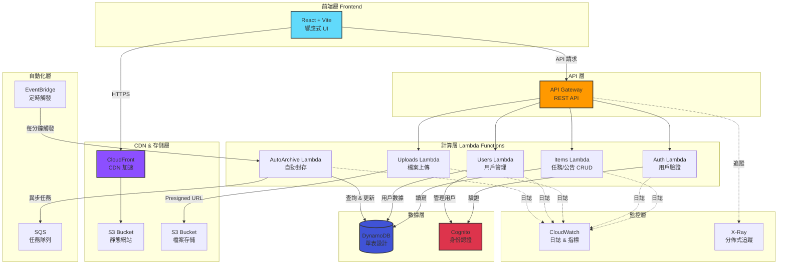
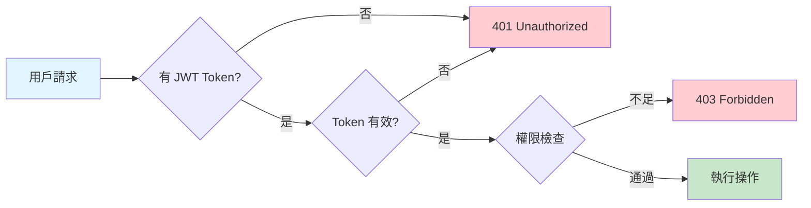

# SparkBoard 系統架構圖

## 系統架構總覽



## 核心數據流

### 1️⃣ 用戶訊問流程
```
用戶瀏覽器 → CloudFront → S3 靜態網站 → React 應用載入
```

### 2️⃣ API 請求流程
```
React 應用 → API Gateway → Lambda 函數 → DynamoDB/S3/Cognito → 回應
```

### 3️⃣ 檔案上傳流程
```
React 應用 → Uploads Lambda (取得 Presigned URL) 
          → 直接上傳到 S3 → 存儲檔案 metadata 到 DynamoDB
```

### 4️⃣ 自動封存流程
```
EventBridge (每分鐘) → AutoArchive Lambda → 檢查 DynamoDB 
                                        → 更新過期任務狀態
```

### 5️⃣ 身份驗證流程
```
用戶登入 → Cognito 驗證 → 取得 JWT Token 
        → 攜帶 Token 訪問 API Gateway → Lambda 驗證 Token
```

## 技術特點

| 層級 | 技術 | 特點 |
|------|------|------|
| **前端** | React 19 + Vite | 快速開發、熱更新、TypeScript |
| **CDN** | CloudFront | 全球加速、HTTPS、快取 |
| **API** | API Gateway | RESTful、CORS、速率限制 |
| **計算** | Lambda (Node.js) | 無伺服器、自動擴展、按需付費 |
| **數據** | DynamoDB | NoSQL、單表設計、GSI 索引 |
| **存儲** | S3 | 對象存儲、Presigned URL、生命週期 |
| **認證** | Cognito | OAuth 2.0、JWT、用戶池 |
| **自動化** | EventBridge | Cron 表達式、事件驅動 |
| **隊列** | SQS | 異步處理、解耦、重試機制 |
| **監控** | CloudWatch + X-Ray | 日誌聚合、指標、分佈式追蹤 |

## DynamoDB 單表設計

```
主表：SparkTable
├── PK: ORG#{orgId}
├── SK: ITEM#{itemId} | USER#{userId} | ANNOUNCEMENT#{announcementId}
├── GSI1: userId-createdAt-index (用戶的項目)
└── GSI2: type-createdAt-index (全局動態)
```

## Lambda 函數職責

| Lambda | 功能 | 觸發方式 |
|--------|------|---------|
| **Items** | 任務/公告 CRUD | API Gateway |
| **AuthMe** | 取得當前用戶資訊 | API Gateway |
| **Uploads** | 生成 S3 Presigned URL | API Gateway |
| **Users** | 用戶管理（管理員） | API Gateway |
| **AutoArchive** | 自動封存已完成任務 | EventBridge (每分鐘) |
| **PostConfirm** | 新用戶自動加入群組 | Cognito Trigger |
| **Health** | 健康檢查 | API Gateway |
| **Monitoring** | 查詢 CloudWatch 指標 | API Gateway |

## 安全機制



### 權限層級
- **Admin（管理員）**：完整系統控制、用戶管理、強制刪除
- **Moderators（版主）**：發布公告、管理內容、編輯他人項目
- **Users（一般用戶）**：創建任務、管理自己的項目

---

**最後更新：** 2025-11-18  
**架構版本：** 1.0.0
